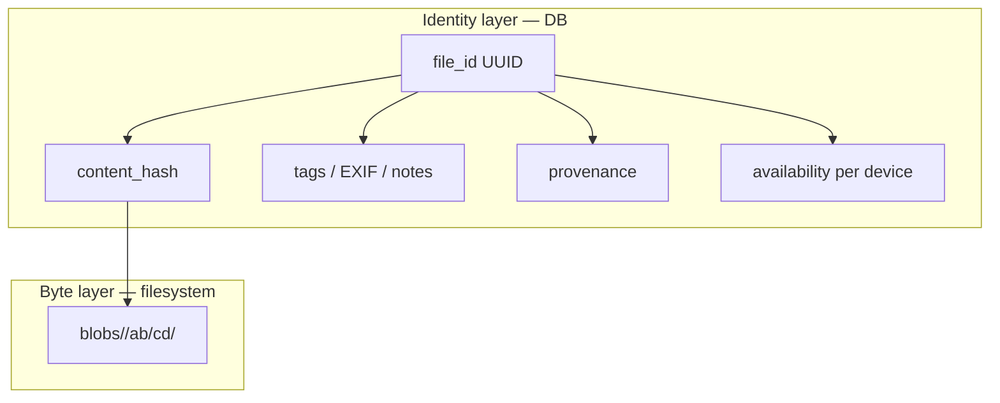
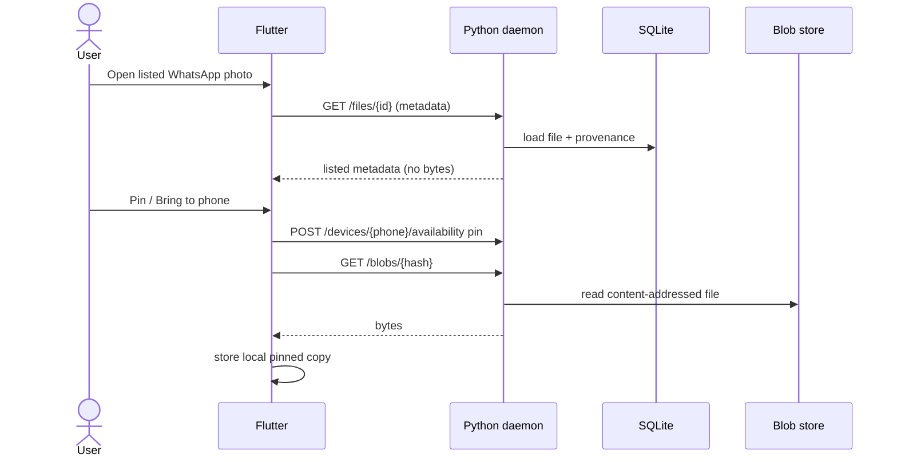

# AGENTS.md — Homesync

Instructions for AI coding agents (and humans driving them) working in this repository.

Read this file before making non-trivial changes. Prefer the design docs under `docs/` over inventing a new architecture mid-flight.

---

## What this project is

**Homesync** is a personal file **catalog** with **selective materialization**:

- **Linux/NixOS** holds the full blob store and the canonical SQLite catalog.
- **Android (Flutter)** holds a catalog replica (or queryable view) plus only the blobs the user pins/caches.
- The product is **not** Syncthing-style always-mirror sync. Many files on the phone are **listed only** (name, type, size, tags, maybe thumbnail) without full bytes.

If a change would turn this into “every file always on every device,” stop and re-read `docs/architecture.md`.

---

## Mental model (agents must internalize)



**Rules of thumb**

1. **DB is source of truth for meaning** (what file is this, tags, where it came from, who has a copy).
2. **Filesystem is source of truth for bytes** (content-addressed preferred).
3. **Never merge divergent blobs.** Same hash ⇒ same file. Different hash ⇒ new version / new content row.
4. **Deletes are soft** until GC proves no references remain.
5. **Phone policies are per-file (or per-album) availability**, not a single global sync mode.

---

## Repository map

| Path | Role | Stack |
|---|---|---|
| `backend/` | Catalog daemon + API + indexer + `homesync` CLI | Python 3.12, FastAPI, SQLAlchemy, SQLite, uv |
| `mobile/` | Android client | Flutter (Android only — no Linux/desktop Flutter target) |
| `flake.nix` | Dev shells | `default`/`backend` (light), `mobile` (Flutter + JDK) |
| `docs/` | Design docs | Canonical product/tech decisions |

Do **not** create a second competing backend language (Go/Rust) unless the human explicitly asks. Python was chosen for ship-speed on a weak machine; uv avoids Nix compiling heavy native Python wheels.

---

## Before you write code

1. Check whether the task is already specified in `docs/roadmap.md` build order. Prefer implementing the next roadmap slice over jumping ahead (e.g. don’t build CRDTs before catalog list + pin download works).
2. Match existing style: small modules, typed Python 3.12+, Flutter idioms already in `mobile/`.
3. Prefer extending the planned schema in `docs/data-model.md` over ad-hoc JSON blobs—unless the field is truly experimental and documented as such.
4. Do not add markdown docs the human didn’t ask for **except** updates to existing design docs when the design actually changes.
5. Do not commit unless asked. Do not force-push. Do not rewrite git history.

---

## Architecture constraints (non-negotiable for v1)

### Availability modes (phone)

| Mode | Phone has metadata | Phone has full bytes | Survives eviction |
|---|---|---|---|
| `listed` | Yes | No | N/A |
| `cached` | Yes | Temporary | No (LRU / on-demand) |
| `pinned` | Yes | Yes | Yes (also stored on Linux) |

Linux is assumed to hold the full corpus unless a blob was never ingested.

### Provenance

Every logical file should be able to answer:

- Which device/path first introduced it?
- Which app/source (Camera, WhatsApp, Downloads, manual import, …)?
- Is the original still present on the source device, or tombstoned there?

WhatsApp restore flow is a **required** motivating example—see `docs/sync-protocol.md`.

### Sync / conflicts (v1)

- Catalog: **last-write-wins** with timestamps (and optional `revision` / `updated_at` monotonic per row).
- Blobs: **content-addressed; no merge**.
- Transport: HTTP (REST is fine). Auth token later; network via Tailscale/LAN.
- **No CRDTs, no multi-master blob conflict resolution** until roadmap says otherwise.

### Storage layout (target)

`$data_root` resolves as `$HOMESYNC_DATA` > `data_dir` in `~/.config/homesync/config.toml` (or `$HOMESYNC_CONFIG`) > `~/.local/share/homesync`. Use `homesync-migrate-data --to <path>` to copy an existing store and update the config.

```text
$data_root/   # managed store (catalog + blobs), not library roots
  catalog.sqlite
  blobs/
    <algo>/                 # e.g. blake3 (matches /v1/blobs/{algo}/{hash})
      ab/                   # hash[0:2]
        cd/                 # hash[2:4]
          <full_hex_hash>   # raw bytes, no extension
  uploads/                  # resumable partials; promote into blobs/ on complete
  thumbs/                   # optional, derived
    <file_id or hash>.jpg
  quarantine/               # collision / integrity rejects only (not normal store)
```

Two-level hex fan-out avoids huge flat directories (GUI file managers / `ls`). Catalog is the UX — do not treat browsing `blobs/` as the product. Library-root files may stay **hash-in-place** until copied into this store. Same `(algo, hash)` ⇒ one blob; never overwrite on size/byte mismatch (see `docs/architecture.md`).

Display names and “original paths” live in the DB, not as the only identity.

---

## Dev environment rules

### Nix

- Default shell = **backend** (Python + uv + sqlite + ruff). Keep it light.
- Flutter work = `nix develop .#mobile` (or change `.envrc` temporarily to `use flake .#mobile`).
- Reuse `$HOME/.android-sdk` like other projects in this user’s `~/repo` (see `installdeps` / `connectadb` in the flake).
- **Do not** switch the backend flake to `python.withPackages` that pulls Pillow/SciPy/etc. Use **uv** + wheels in `backend/.venv`.

### Python backend

```bash
nix develop
cd backend
uv sync --extra dev
uv run homesync-server          # 127.0.0.1:8787
uv run homesync init            # register this machine; then homesync ls / pin / ingest
# auto-reload while hacking: HOMESYNC_RELOAD=1 uv run homesync-server
uv run pytest                   # scenario E2E (required after exit-check work)
ruff check .
```

- Package lives under `backend/src/homesync_server/`.
- Keep dependencies lean; add heavy imaging deps only when thumbnail/index work starts, via uv—not Nix `withPackages`.
- Prefer SQLAlchemy 2.x style, Pydantic v2 models for API schemas.
- Bind localhost by default.

### Flutter mobile

```bash
nix develop .#mobile
cd mobile
flutter run
```

- **Android only.** Do not `flutter create` Linux/Windows/Web unless the human asks.
- Local catalog: SQLite on device (implementation TBD; document choice when added).
- Never assume the full library is on device.

---

## Coding standards for agents

### General

- Change only what the task needs. No drive-by refactors.
- No secrets in the repo (tokens, Tailscale keys, etc.).
- Update `docs/` when you change behavior that those docs claim is true.
- When adding an API endpoint, update `docs/sync-protocol.md` (even briefly).

### Python

- Type hints on public functions.
- Explicit error types / HTTP codes for API failures.
- Migrations: when schema lands, use a real migration story (Alembic or documented SQL versions)—don’t silently `CREATE TABLE` forever without a version table.

### Flutter / Dart

- Keep UI dumb; put sync/catalog logic in `features/*/data` + Cubits in `presentation`.
- Respect availability: UI must render `listed` items without attempting full-file open unless user requests materialization.
- Display `title` may differ from PC path basename and from on-device pin path (hash-addressed).
- Codegen (`*.g.dart`, `*.freezed.dart`) is **not** in git — run `build_runner` via `scripts/mobile_check.sh`.

### Testing

- **Backend AI guardrail:** scenario E2E under `backend/tests/` (FastAPI `TestClient`, temp `$HOMESYNC_DATA`). After implementing a roadmap exit check, add/update the matching `tests/scenarios/…` module and run `uv sync --extra dev && uv run pytest`. Do not mark a milestone done without that scenario.
- **Mobile AI guardrail (when changing `mobile/`):** phone-free scenarios under `mobile/test/scenarios/` (`*_test.dart`, named like roadmap exit checks). Run `nix develop .#mobile --command ./scripts/mobile_check.sh` (pub get → build_runner → analyze → test). Do not mark a mobile exit check done without the scenario.
- Prefer catalog invariants (hash identity, soft delete, availability transitions) and API/client scenarios over UI snapshot spam.
- Don’t require a phone for backend or Flutter unit/scenario tests. Flutter `integration_test` / Maestro stays deferred; never block catalog/API work on emulator tests.
- Do not skip or delete failing exit-check scenarios to greenwash a change.

---

## Product language (use consistently)

| Prefer | Avoid |
|---|---|
| catalog | “the sync DB” as the only name |
| materialize / pin / list | “download everything” |
| logical file / `file_id` | path-as-identity |
| provenance | “origin maybe” undocumented fields |
| tombstone / soft delete | silent unlink of catalog rows |

---

## Common agent failure modes

| Failure | Corrective |
|---|---|
| Building full bidirectional mirror sync | Revert to catalog + availability modes |
| Using filesystem path as primary key | Use `file_id` + hash |
| Pulling Pillow via Nix `withPackages` | Add via `uv` if needed |
| Adding Flutter Linux desktop target | Android only |
| Implementing CRDT “to be safe” | LWW timestamps for v1 |
| Exposing daemon on `0.0.0.0` without auth | Keep localhost / VPN |
| Huge unrelated markdown / README churn | Touch docs only when design changes or human asks |

---

## Where to look next

| If you are… | Read |
|---|---|
| Designing tables / tags | `docs/data-model.md` |
| Implementing API or phone sync | `docs/sync-protocol.md` |
| Setting up a machine | `docs/development.md` |
| Choosing what to build next | `docs/roadmap.md` |
| Unsure of system shape | `docs/architecture.md` |

---

## Diagram: happy-path phone restore



Agents implementing this flow should make each step explicit in code (availability mutation ≠ blob download; both are required for pin).
