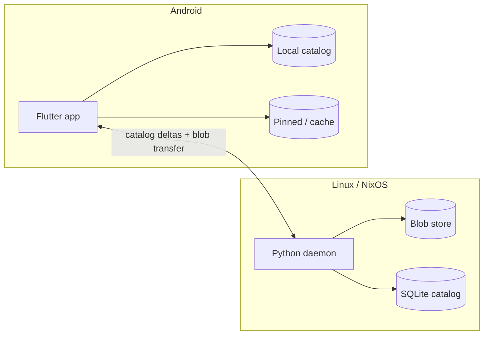

# Homesync

Personal **catalog + selective materialization** between a Linux/NixOS host (source of truth for file bytes) and an Android phone (Flutter client).

This is **not** classic two-way sync like Syncthing. The database owns *identity, tags, provenance, and per-device availability*; the filesystem stores blobs. The phone can list everything, pin what must stay local, and restore files that once lived on the phone but now only exist on the PC.



## Status

Early scaffolding:

| Piece | State |
|---|---|
| Nix flake (`backend` / `mobile` shells) | Ready |
| Python FastAPI health endpoint | Ready |
| Flutter Android app skeleton | Ready |
| Catalog schema, indexer, sync protocol | Planned — see [docs/](docs/) |

## Repo layout

```text
homesync/
├── AGENTS.md              # Instructions for AI agents (and humans pairing with them)
├── flake.nix              # Nix dev shells
├── backend/               # Python catalog daemon
│   ├── pyproject.toml
│   ├── uv.lock
│   └── src/homesync_server/
├── mobile/                # Flutter Android client
│   └── lib/
└── docs/                  # Design & implementation docs
```

## Quick start

### Backend (default, light)

```bash
cd ~/repo/homesync
nix develop                 # or: direnv allow
cd backend && uv sync
uv run homesync-server      # http://127.0.0.1:8787/health
uv run homesync init && uv run homesync ls   # Linux catalog client
```

### Mobile

```bash
nix develop .#mobile
# first time / SDK updates:
installdeps
cd mobile && flutter run
```

Default shell is **backend-only** so potato PCs don’t pull Flutter/JDK on every enter. Use `.#mobile` when working on the app.

## Core ideas (one screen)

| Concept | Meaning |
|---|---|
| **Logical file** | Stable `file_id` (UUID) that survives renames and device deletes |
| **Content hash** | Dedup + integrity; blob path derived from hash |
| **Provenance** | Where it came from (WhatsApp, Camera, PC path, …) |
| **Availability** | Per device: `listed` \| `cached` \| `pinned` |
| **Soft delete** | Tombstone in DB; GC blobs only when nothing references them |

Example: WhatsApp image deleted on phone → still in catalog with PC blob → phone taps “bring to phone” → clone by hash.

## Documentation map

| Doc | What it covers |
|---|---|
| [AGENTS.md](AGENTS.md) | How agents should work in this repo |
| [docs/architecture.md](docs/architecture.md) | System design, components, boundaries |
| [docs/data-model.md](docs/data-model.md) | Schema, identities, tags, availability |
| [docs/sync-protocol.md](docs/sync-protocol.md) | Catalog deltas, blob transfer, conflicts |
| [docs/development.md](docs/development.md) | Nix, uv, Flutter, conventions |
| [docs/roadmap.md](docs/roadmap.md) | Build order and non-goals |

## Transport note

Prefer LAN or Tailscale/WireGuard. Do not expose the daemon on the public internet without auth. v1 can bind `127.0.0.1` + VPN.
