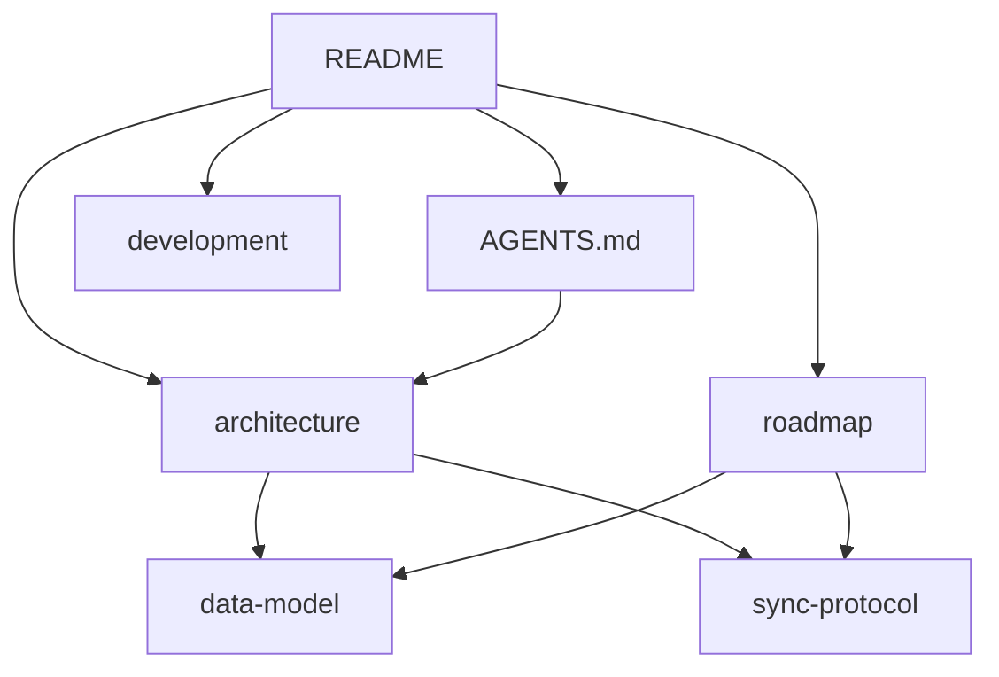

# Docs index

| Document | Audience | Purpose |
|---|---|---|
| [../README.md](../README.md) | Everyone | Entry point, quick start |
| [../AGENTS.md](../AGENTS.md) | AI agents + pair programmers | Operating constraints |
| [architecture.md](architecture.md) | Design | Components, trust, SoT split |
| [data-model.md](data-model.md) | Implementers | Schema, identity, tags, availability |
| [sync-protocol.md](sync-protocol.md) | Implementers | Delta catalog, blobs, restore flow |
| [development.md](development.md) | Contributors | Nix, uv, Flutter workflows |
| [roadmap.md](roadmap.md) | Planning | Build order, non-goals, decisions |

