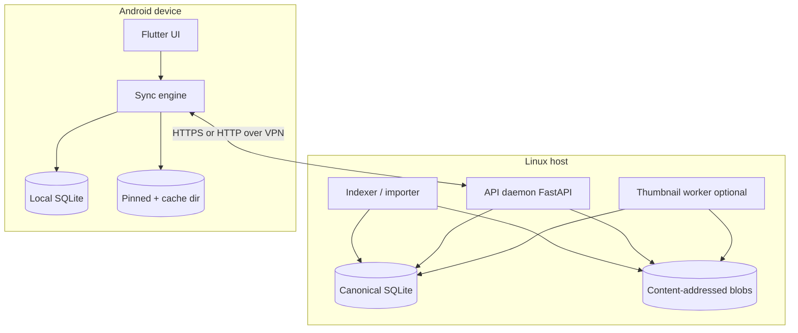
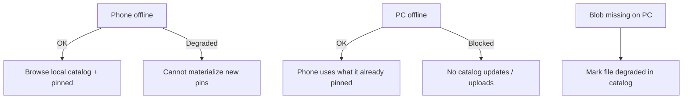
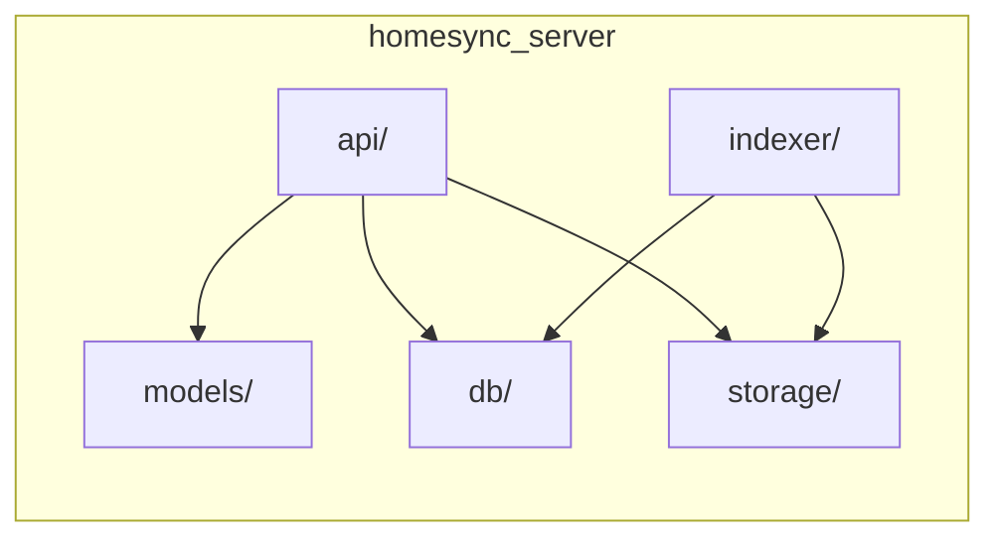

# Architecture

Homesync is a **catalog + selective materialization** system for one primary Linux host and one or more phones.

## Problem statement

You want:

1. Files **primarily stored on Linux**.
2. A phone app that can **browse / tag / request** those files.
3. Rich **metadata** (tags, notes, EXIF, provenance) that survives path changes and phone deletes.
4. Per-file phone policy:
   - **Pinned** — always available offline on phone *and* retained on Linux.
   - **Listed** — visible in the catalog on phone without full file access.
   - **Cached** (optional middle ground) — temporary local bytes.
5. Ability to **re-materialize** a file onto the phone from the PC (e.g. WhatsApp image deleted on phone, still on PC).

Classic folder sync fights (4) and (5). A catalog-first design embraces them.

## High-level components



### Linux daemon (`backend/`)

Responsibilities:

- Own the **canonical catalog**.
- Serve **metadata APIs** and **blob download/upload**.
- **Index** configured library roots (Photos, Documents, WhatsApp backup dirs, …).
- Record **provenance** on ingest.
- Generate thumbnails so listed-mode phone UI can show previews without full files (`GET /v1/thumbs/{file_id}`).
- Apply **pin/list/cache** policy updates from devices.
- Serve basic catalog search (`GET /v1/files?q=` on title/notes/tags).

### Flutter app (`mobile/`)

Responsibilities:

- Browse catalog (search/filter/tags).
- Edit metadata when online (or queue offline edits — later).
- Set availability: pin / unpin / keep listed.
- Materialize blobs for pin/cache.
- Ingest phone-captured media up to the host with provenance.

### Linux CLI (`homesync`)

Same HTTP client role as Flutter: register `kind=linux`, browse listed metadata, pin+materialize, ingest, tags, tombstone, KeePass outbox. Local pin paths live in `~/.local/share/homesync-client/pins.json`, not in the canonical catalog.

### Out of scope for the core daemon

- Replacing Syncthing for arbitrary project folders unrelated to the catalog.
- Multi-user SaaS / public internet hosting.
- Perfect multi-master conflict magic (v1 is LWW).

## Trust and topology


- v1: daemon listens on `127.0.0.1` or Tailscale IP with a shared token (when auth lands).
- Do not bind `0.0.0.0` to a hostile network without auth + TLS assumptions documented.
- NixOS: `services.homesync` (flake `nixosModules.homesync`) runs `homesync-server` under systemd, data in `/var/lib/homesync` by default. Auth is still later; keep the bind on localhost or VPN.

## Source of truth split

| Concern | Source of truth |
|---|---|
| File bytes | Blob store on Linux (content hash) |
| Logical identity | `file_id` in SQLite |
| Display name / original path | Catalog columns (history optional) |
| Tags / user metadata | Catalog |
| Which device has a full copy | `availability` / `replicas` tables |
| Phone offline UI | Local catalog replica (may lag) |

If catalog and disk disagree (hash missing), the API should surface a **broken/missing blob** state—not invent bytes.

## Library roots

The indexer should support **multiple roots** configured in DB or config, e.g.:

- `~/Pictures`
- `~/Documents`
- `~/WhatsApp/Media` (or a backup export path)

Each ingest stamps `root_id` + relative path for human recovery, while identity remains `file_id`/hash.

### Future: host evacuate / remote-only path (deferred)

Same mental model as phone `listed`: catalog metadata yes, bytes at that path no.

- A path in the catalog is an **attribute**, not a guarantee that bytes exist there on disk.
- **Evacuate** = ensure content is in managed `blobs/`, keep the catalog row (and path attribute), then unlink the source path. Distinct from hash-in-place (file still under a library root).
- Reopen/materialize from the blob store when needed. Soft-detect `gone_at` on indexer scans stays adjacent but is not the same as intentional evacuate.
- Deferred until after phone list / pin / ingest; no new host tooling in v1.

## Blob store layout

Managed content-addressed bytes live under `$HOMESYNC_DATA/blobs/` (never inside the git repo):

```text
$HOMESYNC_DATA/blobs/
  <algo>/                 # e.g. blake3
    ab/                   # content_hash[0:2]
      cd/                 # content_hash[2:4]
        <full_hex_hash>   # raw file bytes
$HOMESYNC_DATA/uploads/   # resumable partials (same fan-out); promote on complete
```

Example: BLAKE3 digest `a1b2c3…` → `blobs/blake3/a1/b2/a1b2c3…`.

| Rule | Detail |
|---|---|
| Fan-out | Two hex directory levels so leaf dirs stay small (file managers / tooling). |
| Algo prefix | Matches `GET/PUT /v1/blobs/{algo}/{hash}`; allows hash migration without mixing digests. |
| Filename | Full hex digest (not truncated); path is self-describing. |
| Hash-in-place | Indexer may leave files under `library_roots` and only store hash+path in SQLite; this layout applies when bytes are **copied into** the managed store (phone ingest, unmanaged import, later dedup migration). |
| Resumable | Phone ingest uses `POST/PATCH /v1/blob-uploads` with offset acks; partials under `uploads/` until hash-verified promote into `blobs/`. |
| UX | Catalog is primary; do not rely on GUI-browsing `blobs/`. |
| Writes | `blob_path(data_root, algo, hex_hash)` helper; create parents; write temp in same leaf dir; `rename` atomically. Missing blob on read → degraded/missing, not invented bytes. |

### Dedup vs true collision

- **Same hash, same bytes** → one blob object; reuse `file_id` / add `file_paths` (normal dedup).
- **Same hash, different bytes** (crypto collision) → refuse overwrite (`409` / integrity error). Compare size (and bytes or re-hash) when the path already exists.

v1 does not ship an automatic collision resolver. If one is ever confirmed: leave the existing blob untouched, quarantine new bytes under `$HOMESYNC_DATA/quarantine/<uuid>`, prove with a second-algorithm digest, then re-key the quarantined object under another algo prefix (e.g. `blobs/sha256/…`) and point the new catalog row at that key. Do not weaken `(algo, hash) → one blob` on the happy path.

## Comparison to adjacent tools

| Tool | Overlap | Why Homesync still exists |
|---|---|---|
| Syncthing | Moves bytes | Weak selective “list only” + rich provenance UX |
| Nextcloud | Files + metadata | Heavy; different product shape |
| Immich | Photos pipeline | Photo-centric; may inspire thumbnail/EXIF code later |

Homesync’s differentiator is **explicit listed vs pinned + provenance-first restore**.

## Failure domains



Design APIs and UI states for degraded/missing, not only the happy path.

## Security sketch (v1 → later)

1. **v1:** network isolation (Tailscale) + optional static bearer token.
2. **Later:** per-device pairing keys, TLS if exposed beyond VPN, capability-limited tokens (read catalog vs write tags vs delete).

Never commit real tokens. Use env / NixOS secrets.

## Implementation boundary diagram



Suggested future package layout (not all present yet): keep HTTP handlers thin; put catalog invariants in services; put hash/FS IO in `storage`.
