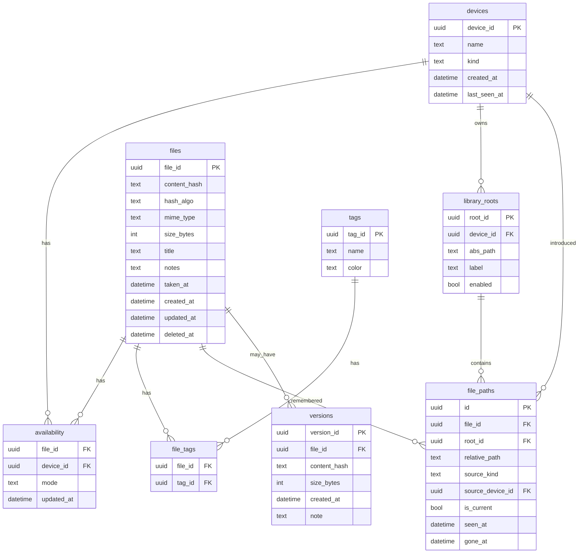
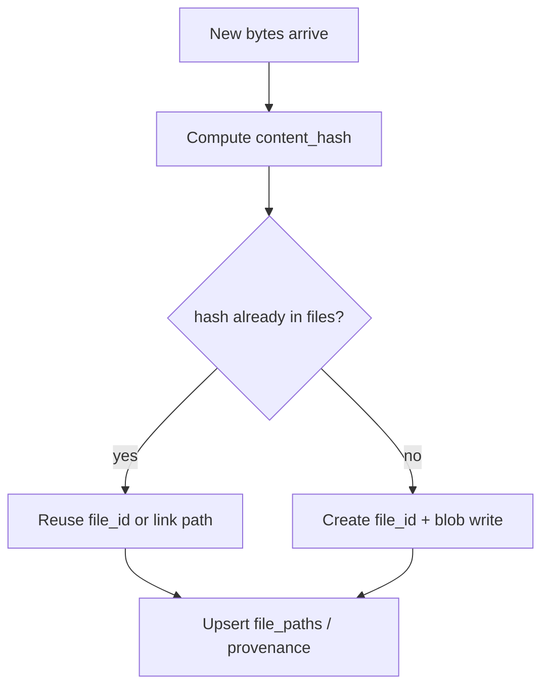

# Data model

This document is the **intended** schema for Homesync. The code may not implement every table yet—when implementing, extend this doc in the same PR/change set if you diverge.

## Design principles

1. **`file_id` (UUID)** is the stable logical identity.
2. **`content_hash`** (BLAKE3 preferred; SHA-256 acceptable) identifies bytes.
3. Paths are **attributes**, not primary keys.
4. Availability is **per device**.
5. Deletes are **soft** (tombstones) until garbage collection.

## Tables (v1 target)

### `devices`

| Column | Type | Notes |
|---|---|---|
| `device_id` | UUID PK | |
| `name` | TEXT | e.g. `pixel`, `nixos-box` |
| `kind` | TEXT | `linux` \| `android` \| … |
| `created_at` | TEXT/DATETIME | ISO-8601 |
| `last_seen_at` | TEXT/DATETIME | |

The Linux host should register itself as a device too—availability on Linux is usually “has blob” implied by blob store presence, but an explicit row helps multi-disk later.

### `library_roots`

| Column | Type | Notes |
|---|---|---|
| `root_id` | UUID PK | |
| `device_id` | UUID FK | Usually the Linux device |
| `abs_path` | TEXT | Absolute path on that device |
| `label` | TEXT | `Pictures`, `WhatsApp`, … |
| `enabled` | INT/BOOL | |

### `files`

Logical file row (current head metadata).

| Column | Type | Notes |
|---|---|---|
| `file_id` | UUID PK | |
| `content_hash` | TEXT NOT NULL | Hex digest of current head. Soft-deleted rows store `tombstone:{file_id}:{hex}` so UNIQUE(`content_hash`) does not block re-ingest / content-replace under another `file_id`. API responses always expose the real hex. |
| `hash_algo` | TEXT | `blake3` / `sha256` |
| `mime_type` | TEXT | |
| `size_bytes` | INTEGER | |
| `title` | TEXT | Display name; may differ from path basename |
| `notes` | TEXT | Freeform |
| `taken_at` | DATETIME | From EXIF if known |
| `created_at` | DATETIME | Row creation |
| `updated_at` | DATETIME | Catalog LWW |
| `deleted_at` | DATETIME NULL | Soft delete |

Optional JSON column `exif_json` is acceptable early; normalize later if needed.

API responses may include computed `has_thumb` (not a DB column): `true` when `mime_type` starts with `image/`, meaning `GET /v1/thumbs/{file_id}` may return a JPEG. Derived thumbs live on disk at `thumbs/<hh>/<hh>/<content_hash>.jpg` (see `docs/architecture.md` / storage layout).

### `file_paths` (provenance + human path history)

| Column | Type | Notes |
|---|---|---|
| `id` | INTEGER/UUID PK | |
| `file_id` | UUID FK | |
| `root_id` | UUID NULL FK | Null if standalone ingest |
| `relative_path` | TEXT | Path under root |
| `source_kind` | TEXT | `camera` \| `whatsapp` \| `download` \| `misc` \| `manual` (legacy) \| `unknown` |
| `source_device_id` | UUID NULL | Device that introduced this path |
| `is_current` | BOOL | Current known path on Linux indexer |
| `seen_at` | DATETIME | |
| `gone_at` | DATETIME NULL | Path no longer found on indexer run |

**WhatsApp example:** phone deletes local media → phone availability becomes listed/absent → Linux `file_paths` still points at PC copy → user can pin and fetch by `content_hash`.

### `versions` (Milestone 8)

When bytes change for the same logical file, archive the previous head:

| Column | Type | Notes |
|---|---|---|
| `version_id` | UUID PK | |
| `file_id` | UUID FK | Stable logical identity |
| `content_hash` | TEXT | Previous head hash |
| `size_bytes` | INTEGER | |
| `created_at` | DATETIME | When archived |
| `note` | TEXT | Optional (e.g. phone edit) |

Implemented in schema migration `004_versions.sql`. Current head stays on `files`; `POST /v1/files/{file_id}/content` appends a version then updates the head. Policy: same logical photo edited → new version under the same `file_id`; unrelated file → new `file_id`. History starts at first Homesync observation (no backfilled phantom versions).

For **`.kdbx`**, divergent content may open a conflict outbox instead of immediately changing head — see Milestone 9 / `docs/sync-protocol.md` (KeePass conflict outbox). Candidate hashes are archived into `versions` on resolve.

### `tags` / `file_tags`

Simple many-to-many. Tag names unique per library (casefold via `COLLATE NOCASE`).

Implemented in schema migration `002_tags.sql` (Milestone 2). Tagging a file bumps `files.updated_at` so catalog delta clients observe the change.
### `availability`

| Column | Type | Notes |
|---|---|---|
| `file_id` | UUID FK | |
| `device_id` | UUID FK | |
| `mode` | TEXT | `listed` \| `cached` \| `pinned` |
| `updated_at` | DATETIME | LWW field |
| PRIMARY KEY | `(file_id, device_id)` | |

Implemented in schema migration `003_availability.sql` (Milestone 4). Availability edits bump `files.updated_at` so catalog delta clients observe the change.

Semantics:

- **`listed`**: device may show metadata; should not expect full bytes.
- **`cached`**: bytes may exist locally; daemon/app may evict.
- **`pinned`**: bytes must be kept locally; Linux should also retain blob.

Absence of a row on phone can mean “unknown / not yet synced policy”; define API so phone always materializes a mode after first catalog pull (default `listed` for remote-only files).

### `replicas` (optional explicit “has bytes here”)

If you need stronger tracking than mode:

| Column | Type | Notes |
|---|---|---|
| `file_id` | UUID | |
| `device_id` | UUID | |
| `content_hash` | TEXT | What hash is present |
| `state` | TEXT | `present` \| `missing` \| `partial` |
| `last_verified_at` | DATETIME | |

`pinned` + `missing` = degraded pin (UI should offer re-fetch).

### `gc_purges` (hard-delete log)

Soft-deleted rows (`files.deleted_at`) stay in the catalog until **GC** hard-purges them. Each hard purge appends a row so phones can drop leftover tombstone mirrors (Removed from PC) without a full catalog reset.

| Column | Type | Notes |
|---|---|---|
| `file_id` | UUID PK | Logical file that was hard-deleted |
| `purged_at` | DATETIME | When GC removed it |

Implemented in schema migration `007_gc_purges.sql`. Catalog delta returns `purged[]` / `next_purge_cursor` for clients that pass `purge_since`. Managed blobs/thumbs are unlinked only when no remaining file head, `versions`, or kdbx conflict candidate references the hash. Hash-in-place library roots are never unlinked by GC.

## Identity rules

Dedup policy recommendation:

- Same hash from a new path → **same `file_id`**, add `file_paths` row (dedup storage).
- User insists on separate logical items with identical bytes (rare) → allow force-new `file_id` later; not needed in v1.
- On blob write, if `blobs/<algo>/…/<hash>` already exists: identical bytes → no-op; size/byte mismatch → **abort** (never overwrite). True-collision repair is offline (quarantine + re-key under another algo) — see `docs/architecture.md` Blob store layout.
- Filesystem path for managed blobs: `blobs/<algo>/<hh>/<hh>/<fullhash>` (two-level hex fan-out).

## Metadata vs filesystem sidecars

Prefer **catalog tables** for tags/notes. Optional export of sidecars (XMP) can be a later feature; don’t require sidecars for correctness.

## Migrations

When schema lands in code:

- Maintain `schema_version` table.
- Use Alembic **or** ordered SQL migration files applied by the daemon at startup.
- Never rely on “delete sqlite and reindex” as the only story once real user tags exist.

## Indexing suggestions

- Unique index on `files(content_hash)` (if 1:1 hash↔file_id policy).
- Index `file_tags(tag_id)`.
- Index `availability(device_id, mode)`.
- Index `files(deleted_at)`, `files(updated_at)` for delta sync.
