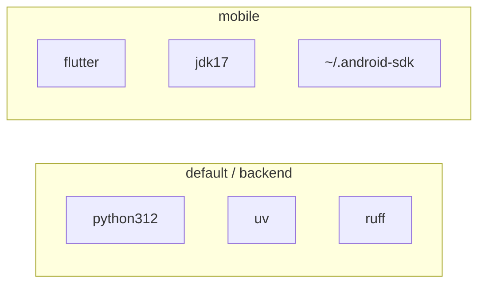

# Development guide

## Prerequisites

- Nix with flakes enabled (NixOS or multi-user Nix).
- For mobile: Android device/emulator, and typically `$HOME/.android-sdk` (this flake’s `installdeps` helper).
- Optional: direnv (`use flake` in `.envrc`).

## Nix shells

| Command | Provides | When to use |
|---|---|---|
| `nix develop` / `.#backend` / `.#default` | Python 3.12, uv, sqlite, ruff | Daemon, schema, API |
| `nix develop .#mobile` | Flutter, JDK 17, Gradle, adb helpers | Android app |

Default is **backend-only** on purpose (weak machines / potato PCs). Do not “helpfully” merge Flutter into the default shell without an explicit ask.



### Direnv

`.envrc` contains `use flake` → loads backend. For a Flutter-focused session, temporarily use:

```bash
# .envrc
use flake .#mobile
```

or open a separate terminal with `nix develop .#mobile`.

### Android helpers (from flake)

- `installdeps` — ensure cmdline-tools / platform-tools / platform 35 / build-tools in `$HOME/.android-sdk`.
- `connectadb <ip>` — scan high ports and `adb connect` (wireless debugging).

Same pattern as other repos under `~/repo` (`camshare`, `fileman`).

## Backend workflow

```bash
cd /home/hamburgir/repo/homesync
nix develop
cd backend
uv sync --extra dev
uv run homesync-server
# → http://127.0.0.1:8787/health

# Index a library folder (hash-in-place; uses $HOMESYNC_DATA)
uv run homesync-index --root ~/Pictures --label Pictures
```

### Layout

```text
backend/
  pyproject.toml
  uv.lock                 # commit this
  .venv/                  # gitignored; created by uv
  src/homesync_server/
    __init__.py
    main.py               # FastAPI app entry (+ DB bootstrap on lifespan)
    cli.py                # homesync-index
    config.py             # HOMESYNC_DATA
    db/                   # engine, migrations
    models/               # SQLAlchemy catalog tables
    storage/              # hash (+ blob_path helper)
    indexer/              # walk library roots
  tests/
    conftest.py           # temp HOMESYNC_DATA + TestClient fixtures
    test_health.py        # Milestone 0 smoke
    scenarios/            # roadmap exit-check E2E (grow with features)
```

### Dependency policy

- Add Python deps with **uv** (`uv add …`), not with Nix `python.withPackages`.
- Why: Nix packaging of scientific/imaging stacks can compile SciPy/Pillow forever on a weak PC.
- `ruff` comes from the Nix shell (binary). Dev tools (pytest, ruff): `uv sync --extra dev`.

### Suggested module growth

As features land:

```text
homesync_server/
  main.py              # app factory / router mount
  api/                 # routes
  models/              # SQLAlchemy
  schemas/             # Pydantic
  services/            # catalog invariants
  storage/             # hash, blob paths, atomic writes
  indexer/             # walk roots
```

Keep handlers thin.

## Mobile workflow

```bash
nix develop .#mobile
installdeps            # if SDK incomplete
cd mobile
flutter pub get
flutter run
```

- Target **Android only**.
- App id / org used at create time: `com.homesync` / `homesync_mobile`.

### Suggested Flutter structure (when you leave the counter demo)

```text
lib/
  main.dart
  app.dart
  features/
    catalog/
    pins/
    tags/
  data/
    api/
    local_db/
    sync/
```

## Data directories (local dev)

Recommend a configurable `$HOMESYNC_DATA` (default e.g. `~/.local/share/homesync`):

```text
$HOMESYNC_DATA/
  catalog.sqlite
  blobs/<algo>/<hh>/<hh>/<fullhash>   # see docs/architecture.md
  thumbs/
  quarantine/                         # integrity rejects only
```

Do not store blobs inside the git repo. `data/` and `blobs/` are gitignored at repo root for accidental local runs.

## Quality checks

### Backend scenario E2E

Agents and humans should treat `uv run pytest` as the AI-proof guardrail. Tests use FastAPI `TestClient` against an isolated temp `$HOMESYNC_DATA` (see `tests/conftest.py`) — no phone, no real network bind.

```bash
cd backend
uv sync --extra dev
ruff check .
uv run pytest
```

| Kind | Path | When to add |
|---|---|---|
| Smoke | `tests/test_health.py` | Milestone 0 (exists) |
| Exit-check scenarios | `tests/scenarios/test_*.py` | With each roadmap milestone feature |

Naming maps to roadmap exit checks (`test_indexer.py`, `test_metadata_api.py`, `test_pin_materialize.py`, …). Do **not** stub failing placeholders for unfinished milestones — add the scenario when the feature lands.

Flutter / device E2E (`integration_test` or Maestro) is deferred until list + pin UI exists; do not block backend work on an emulator.

### Mobile

```bash
cd mobile
flutter analyze
flutter test
```

## Editing the flake

- Keep `shallow=1` on inputs if you like faster locks (matches sibling projects).
- After flake input changes: `nix flake lock` / update as needed.
- Flakes in a dirty git tree need tracked `flake.nix` / `flake.lock` for some Nix versions—`git add` those files if `nix develop` complains.

## Documentation hygiene

When you change:

| Change | Update |
|---|---|
| Availability semantics | `docs/data-model.md`, `AGENTS.md` |
| API routes / sync behavior | `docs/sync-protocol.md` |
| Components / trust model | `docs/architecture.md` |
| Build order / non-goals | `docs/roadmap.md` |
| How to run tools | this file |

Agents: see root `AGENTS.md` and `docs/`.
