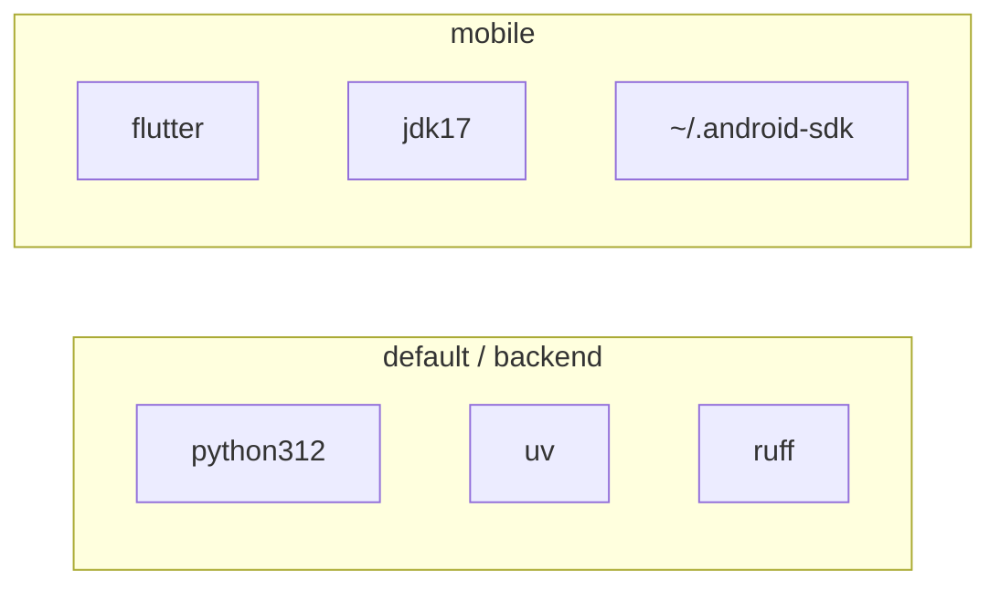

# Development guide

## Prerequisites

- Nix with flakes enabled (NixOS or multi-user Nix).
- For mobile: Android device/emulator, and typically `$HOME/.android-sdk` (this flake’s `installdeps` helper).
- Optional: direnv (`use flake` in `.envrc`).

## Nix shells

| Command | Provides | When to use |
|---|---|---|
| `nix develop` / `.#backend` / `.#default` | Python 3.12, uv, sqlite, ruff | Daemon, schema, API |
| `nix develop .#mobile` | Flutter, JDK 17, Gradle, adb helpers | Android app |

Default is **backend-only** on purpose (weak machines / potato PCs). Do not “helpfully” merge Flutter into the default shell without an explicit ask.



### Direnv

`.envrc` contains `use flake` → loads backend. For a Flutter-focused session, temporarily use:

```bash
# .envrc
use flake .#mobile
```

or open a separate terminal with `nix develop .#mobile`.

### Android helpers (from flake)

- `installdeps` — ensure cmdline-tools / platform-tools / platform 35 / build-tools in `$HOME/.android-sdk`.
- `connectadb <ip>` — scan high ports and `adb connect` (wireless debugging).

Same pattern as other repos under `~/repo` (`camshare`, `fileman`).

## Backend workflow

```bash
cd /home/hamburgir/repo/homesync
nix develop
cd backend
uv sync --extra dev
uv run homesync-server
# → http://127.0.0.1:8787/health
# Phone / LAN: HOMESYNC_HOST=0.0.0.0 uv run homesync-server  (no auth yet; LAN/VPN only)

# Index a library folder (hash-in-place; uses resolved data root)
uv run homesync-index --root ~/Pictures --label Pictures

# Move managed store to another disk (stop the daemon first)
uv run homesync-migrate-data --to /mnt/your-hdd/homesync

# Metadata API smoke (daemon running; catalog indexed)
../scripts/metadata_api_smoke.sh
```

### Layout

```text
backend/
  pyproject.toml
  uv.lock                 # commit this
  .venv/                  # gitignored; created by uv
  src/homesync_server/
    __init__.py
    main.py               # FastAPI app entry (+ DB bootstrap on lifespan)
    cli.py                # homesync-index
    config.py             # HOMESYNC_DATA / config.toml / data_root
    migrate_data.py       # homesync-migrate-data
    db/                   # engine, migrations
    models/               # SQLAlchemy catalog tables
    storage/              # hash (+ blob_path helper)
    indexer/              # walk library roots
    api/ schemas/ services/
  tests/
    conftest.py           # temp HOMESYNC_DATA + TestClient fixtures
    test_health.py        # Milestone 0 smoke
    test_config.py        # data_dir resolution
    test_migrate_data.py  # migrate CLI
    scenarios/            # roadmap exit-check E2E (grow with features)
```

### Dependency policy

- Add Python deps with **uv** (`uv add …`), not with Nix `python.withPackages`.
- Why: Nix packaging of scientific/imaging stacks can compile SciPy/Pillow forever on a weak PC.
- `ruff` comes from the Nix shell (binary). Dev tools (pytest, ruff): `uv sync --extra dev`.

### Suggested module growth

As features land:

```text
homesync_server/
  main.py              # app factory / router mount
  api/                 # routes (/v1/files, /v1/tags, /v1/catalog/delta)
  schemas/             # Pydantic
  services/            # catalog invariants
  models/              # SQLAlchemy
  storage/             # hash, blob paths, atomic writes
  indexer/             # walk roots
```

Keep handlers thin.

## Mobile workflow

```bash
nix develop .#mobile
installdeps            # if SDK incomplete
cd mobile
flutter pub get
flutter run
```

- Target **Android only**.
- App id / org used at create time: `com.homesync` / `homesync_mobile`.
- Default API base URL on emulator: `http://10.0.2.2:8787` (change in-app Settings for a physical device / Tailscale IP).
- Cleartext HTTP is allowed for LAN/VPN until auth + TLS land.
- First launch: register device via `POST /v1/devices`, pull `/v1/catalog/delta` into on-device **Drift** SQLite (`homesync_catalog_v2`); pull-to-refresh re-syncs. Listings are **metadata only** (`listed`).
- Stack: **Drift**, **Bloc/Cubit**, **get_it + injectable**, **freezed** DTOs, **`package:http`**, **`logger`** (`AppLog`). Not Riverpod / Dio / sqflite.
- Catalog `title` is display-only; may differ from PC path and from future on-device pin filenames (hash paths).

### Flutter structure

```text
lib/
  main.dart
  app/                 # HomesyncApp, injectable DI
  core/                # AppLog, AppException
  features/
    catalog/
      data/            # API, Drift, sync
      presentation/    # CatalogCubit + browse UI
    settings/
      data/
      presentation/
test/
  flutter_test_config.dart
  support/fixtures.dart
  scenarios/           # roadmap-named phone-free exit checks
  widget/
```

Codegen is gitignored. Always:

```bash
nix develop .#mobile --command ./scripts/mobile_check.sh
# = flutter pub get && build_runner && analyze && test
# needs libsqlite3 (shell sets HOMESYNC_SQLITE3_LIB)
```
## Data directories (local dev)

Managed store resolution (first match wins):

1. `$HOMESYNC_DATA` (env; also what tests set)
2. `data_dir` in `$HOMESYNC_CONFIG` or `$XDG_CONFIG_HOME/homesync/config.toml` (default `~/.config/homesync/config.toml`)
3. `~/.local/share/homesync`

Point the store at a large disk by creating a config once:

```toml
# ~/.config/homesync/config.toml
data_dir = "/mnt/your-hdd/homesync"
```

Or migrate an existing store:

```bash
# Stop homesync-server first
uv run homesync-migrate-data --to /mnt/your-hdd/homesync
# Optional: --from ~/.local/share/homesync --delete-source --force
```

Layout under the resolved data root:

```text
<data_root>/
  catalog.sqlite
  blobs/<algo>/<hh>/<hh>/<fullhash>   # see docs/architecture.md
  thumbs/
  quarantine/                         # integrity rejects only
```

Library folders (`homesync-index --root …`) are separate from this managed store — they can also live on the HDD.

Do not store blobs inside the git repo. `data/` and `blobs/` are gitignored at repo root for accidental local runs.

## Quality checks

### Backend scenario E2E

Agents and humans should treat `uv run pytest` as the AI-proof guardrail. Tests use FastAPI `TestClient` against an isolated temp `$HOMESYNC_DATA` (see `tests/conftest.py`) — no phone, no real network bind.

```bash
cd backend
uv sync --extra dev
ruff check .
uv run pytest
```

| Kind | Path | When to add |
|---|---|---|
| Smoke | `tests/test_health.py` | Milestone 0 (exists) |
| Exit-check scenarios | `tests/scenarios/test_*.py` | With each roadmap milestone feature |

Naming maps to roadmap exit checks (`test_indexer.py`, `test_metadata_api.py`, `test_pin_materialize.py`, …). Do **not** stub failing placeholders for unfinished milestones — add the scenario when the feature lands.

Flutter / device E2E (`integration_test` or Maestro) is deferred; do not block backend work on an emulator.

### Mobile scenario E2E

Phone-free Flutter guardrail (Drift in-memory + MockClient). Same spirit as backend scenarios.

```bash
nix develop .#mobile --command ./scripts/mobile_check.sh
```

| Kind | Path | When to add |
|---|---|---|
| Exit-check scenarios | `mobile/test/scenarios/*_test.dart` | With each mobile roadmap exit check |
| Presentational widgets | `mobile/test/widget/` | Thin UI state smoke |

Naming maps to roadmap (`phone_catalog_test.dart`, later `pin_materialize_test.dart`, …). Flutter requires the `*_test.dart` suffix. Do **not** stub failing placeholders for unfinished milestones. Codegen must be generated locally (not in VCS).

## Editing the flake

- Keep `shallow=1` on inputs if you like faster locks (matches sibling projects).
- After flake input changes: `nix flake lock` / update as needed.
- Flakes in a dirty git tree need tracked `flake.nix` / `flake.lock` for some Nix versions—`git add` those files if `nix develop` complains.

## Documentation hygiene

When you change:

| Change | Update |
|---|---|
| Availability semantics | `docs/data-model.md`, `AGENTS.md` |
| API routes / sync behavior | `docs/sync-protocol.md` |
| Components / trust model | `docs/architecture.md` |
| Build order / non-goals | `docs/roadmap.md` |
| How to run tools | this file |

Agents: see root `AGENTS.md` and `docs/`.
