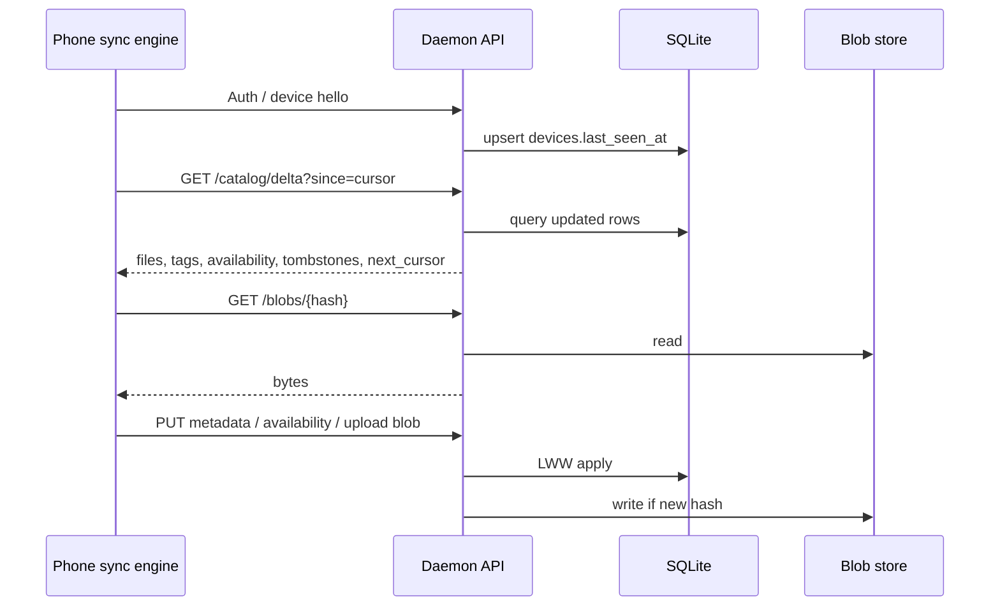
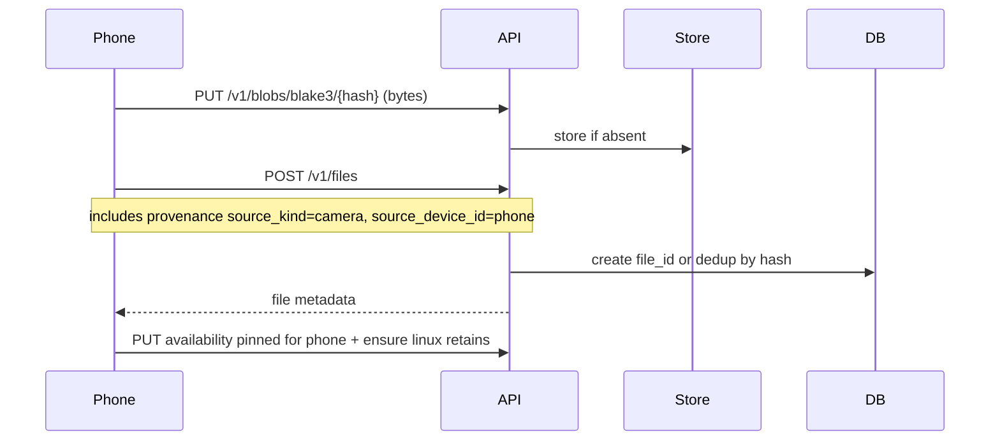
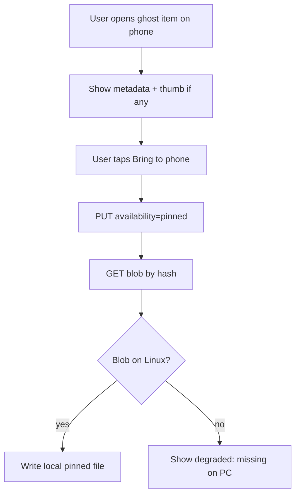
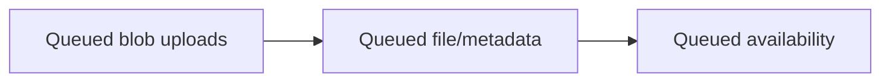

# Sync protocol

Homesync sync is **catalog-first**, then **blob-on-demand**.

## Goals

1. Phone can pull a **delta of catalog changes** since last cursor.
2. Phone can **upload** new files + metadata edits.
3. Phone can **set availability** (`listed` / `cached` / `pinned`).
4. Phone can **download blobs by content hash** (resumable ideally).
5. Conflicts stay boring in v1: **last-write-wins** on metadata rows.

## Actors



## Device registration

```http
POST /v1/devices
{
  "device_id": "…",          // client-generated UUID, stable across reinstalls if possible
  "name": "pixel-8",
  "kind": "android"
}
```

Store pairing secret / bearer token association when auth exists.

## Catalog delta

```http
GET /v1/catalog/delta?since=<cursor>&limit=500
```

**Cursor** recommendations:

- Monotonic `catalog_changes.id` (changelog table), **or**
- `(updated_at, file_id)` tuple carefully handled for equals.

Response shape (illustrative):

```json
{
  "next_cursor": "12345",
  "files": [ { "file_id": "…", "content_hash": "…", "title": "…", "updated_at": "…", "deleted_at": null } ],
  "tags": [ … ],
  "file_tags": [ … ],
  "availability": [ { "file_id": "…", "device_id": "…", "mode": "listed", "updated_at": "…" } ],
  "paths": [ … ]
}
```

Phone applies transactions locally. Deleted files arrive with `deleted_at` set (tombstones), not silent omission forever—omission-only sync is harder to reason about.

## Default availability for remote files

When phone learns about a file that exists only on Linux:

- Insert local availability `listed` for that phone device (unless server already has a row).

Pinned files must appear in availability with `pinned` and trigger blob fetch.

## Blob transfer

```http
GET /v1/blobs/{algo}/{hash}
PUT /v1/blobs/{algo}/{hash}
```

Rules:

- Hash mismatch on upload → `400`.
- Unknown hash on download → `404` (catalog may still list file as degraded).
- Prefer `Content-Length`, `ETag`, and HTTP range requests when implementing resume.

Pin flow is **two steps**:

1. Set availability `pinned`.
2. Ensure blob present locally (download if needed).

Do not treat step 1 alone as success in the UI.

## Metadata updates

```http
PATCH /v1/files/{file_id}
{
  "title": "…",
  "notes": "…",
  "updated_at": "client-time",
  "base_updated_at": "last-seen-server-time"
}
```

**LWW v1:** server accepts if `updated_at` (client) ≥ stored, or use `base_updated_at` to detect mid-air collision and return `409` with server row (client rebases). Pick one and document in code; prefer explicit `409` when easy.

Tags:

```http
PUT /v1/files/{file_id}/tags
{ "tags": ["family", "receipts"] }
```

## Availability updates

```http
PUT /v1/files/{file_id}/availability/{device_id}
{ "mode": "pinned", "updated_at": "…" }
```

Server should allow a device to update **its own** availability primarily. Cross-device admin can wait.

## Phone ingest (camera / exports)



## WhatsApp-style restore (canonical story)

Preconditions:

- File was ingested to Linux (backup/export/indexer).
- Catalog still has `file_id` + `content_hash` + path on PC.
- Phone local bytes deleted; availability may be `listed` or absent.



Provenance rows explain *why* it still exists (“imported from WhatsApp backup on nixos”).

## Conflict matrix (v1)

| Conflict | Resolution |
|---|---|
| Tag edit on phone + PC | LWW by `updated_at` |
| Title edit both sides | LWW |
| Same file pinned on phone, deleted on PC catalog | Tombstone wins if `deleted_at` newer; else keep and mark degraded |
| Two different byte payloads claimed as same `file_id` | Reject; create new version or new file_id — never merge bytes |
| Upload hash already exists | Dedup; attach path/provenance |

## Auth (planned)

```http
Authorization: Bearer <device-token>
```

Until then, rely on network isolation and document the risk in development notes.

## Versioning the API

Prefix with `/v1/`. Breaking changes bump to `/v2/` or negotiated `Accept` version. Catalog cursor format changes are breaking—version the cursor namespace if needed (`v1:12345`).

## Offline queue (phone)

Phone should queue:

- metadata patches
- availability changes
- blob uploads

Flush on reconnect in order: **blobs first** (so hashes exist), then file rows, then availability/tags.



## Non-goals for protocol v1

- Real-time websocket-only sync (polling deltas is fine).
- P2P phone-to-phone without PC.
- Encrypted blob fields end-to-end (maybe later).
- Partial file logical streaming editors (video scrub without download can be a later optimization).
