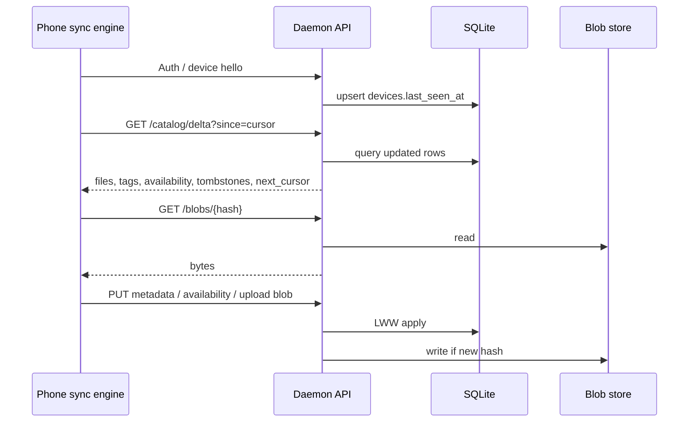
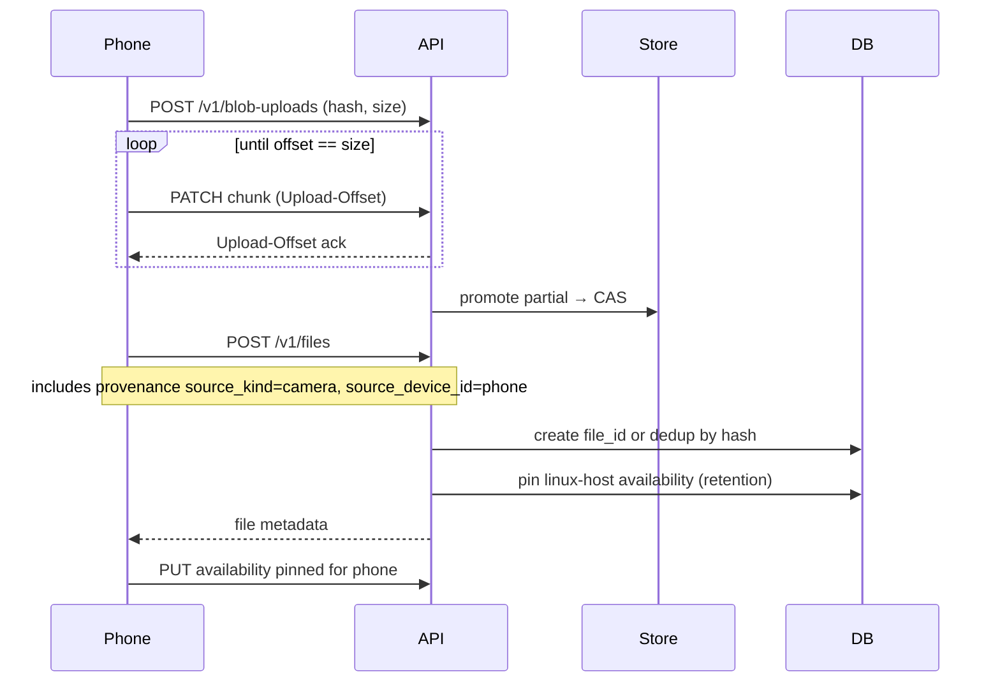
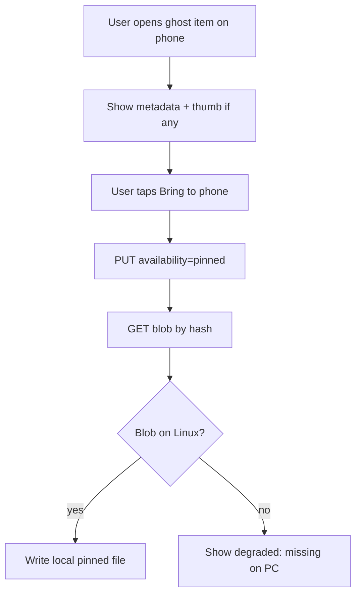

# Sync protocol

Homesync sync is **catalog-first**, then **blob-on-demand**.

## Goals

1. Phone can pull a **delta of catalog changes** since last cursor.
2. Phone can **upload** new files + metadata edits.
3. Phone can **set availability** (`listed` / `cached` / `pinned`).
4. Phone can **download blobs by content hash** (resumable ideally).
5. Conflicts stay boring in v1: **last-write-wins** on metadata rows.

## Actors



## Device registration

Implemented (Milestone 3 + reclaim):

```http
POST /v1/devices
{
  "device_id": "…",          // client-generated UUID
  "name": "pixel-8",
  "kind": "android"          // linux | android | other
}

GET /v1/devices              # list registered devices (reclaim UI)
GET /v1/devices/{device_id}
```

`POST` upserts by `device_id` and refreshes `last_seen_at`. Store pairing secret / bearer token association when auth exists.

**Phone today:** UUID v4 stored in app prefs — stable across restarts, **not** across reinstalls / cleared app data.

**Reclaim (Settings → Device ID):** list server devices (`GET /v1/devices`) or paste a known UUID; bind this install to that `device_id`, clear local availability for the previous id, reset the catalog cursor, re-register, and full-sync so pin rows for the reclaimed id apply. **Reset identity** mints a new UUID (old server rows remain under the abandoned id).

## Catalog delta

```http
GET /v1/catalog/delta?since=<cursor>&limit=500
```

**Cursor (v1 implemented):** opaque `v1:{updated_at}|{file_id}` ordered lexicographically by `(updated_at, file_id)`. Empty / omitted `since` = full scan from the beginning. Tag edits and metadata patches bump `files.updated_at` so they appear in subsequent deltas. A changelog table may replace this later without changing the opaque cursor namespace if we bump to `v2:…`.

Response shape:

```json
{
  "next_cursor": "v1:2026-07-30T12:00:00.000001Z|…",
  "files": [ { "file_id": "…", "content_hash": "…", "title": "…", "updated_at": "…", "deleted_at": null, "tags": ["family"], "has_thumb": false } ],
  "tags": [ { "tag_id": "…", "name": "family", "color": null } ],
  "file_tags": [ { "file_id": "…", "tag_id": "…" } ],
  "availability": [],
  "paths": [ … ]
}
```

`availability` includes rows for the `file_id`s in the page (all devices). Phone applies its own device rows; default local mode for new remote files is `listed` when the server sent no row.

## Default availability for remote files

When phone learns about a file that exists only on Linux:

- Insert local availability `listed` for that phone device (unless server already has a row).

Pinned files must appear in availability with `pinned` and trigger blob fetch.

## Blob transfer

Implemented (Milestone 4 GET + Milestone 5 PUT + resumable uploads):

```http
GET /v1/blobs/{algo}/{hash}
PUT /v1/blobs/{algo}/{hash}          # one-shot (small / legacy)
POST /v1/blob-uploads                # begin or resume session
GET /v1/blob-uploads/{upload_id}     # poll acked offset
PATCH /v1/blob-uploads/{upload_id}   # append chunk (Upload-Offset)
```

**Resumable upload (phone ingest default):**

1. Client hashes the file (BLAKE3), then `POST /v1/blob-uploads` with `{algo, content_hash, size_bytes}`.
2. Server returns `upload_id` (`algo:hash`) and current `offset` (0 for new; resume if a partial exists).
3. Client `PATCH`es ~4 MiB chunks with header `Upload-Offset: <acked>`. Response `Upload-Offset` is the new ack (TCP-style).
4. Offset mismatch → `409` + `Upload-Offset` of the server’s truth; client syncs and continues.
5. When `offset == size_bytes`, server verifies hash, promotes into managed CAS, and sets `X-Upload-Complete: 1`.
6. Disconnect / stall: client re-`GET`s status (or re-`POST`s begin) and continues from the acked offset. Partials live under `$data_root/uploads/…` for up to 7 days; per-chunk client timeout is 1 hour.

Rules (one-shot PUT still apply):

- `GET` resolves managed `blobs/<algo>/<hh>/<hh>/<hash>` first, then a current hash-in-place library path.
- Unknown / missing on disk → `404` (catalog may still list file as degraded).
- Hash mismatch on upload → `400` (PUT) or `409` (resumable finalize).
- Identical existing blob → `200` dedup (`X-Blob-Created: 0`); new object → `201`.
- Size/byte mismatch against an existing object → `409` (never overwrite).
- Response includes `Content-Length`, `ETag`, `X-Content-Hash`, `X-Hash-Algo`. Prefer HTTP range requests when implementing resume.

Pin flow is **two steps**:

1. Set availability `pinned`.
2. Ensure blob present locally (download if needed).

Do not treat step 1 alone as success in the UI.

## Metadata updates

Implemented (Milestone 2):

```http
GET /v1/files
GET /v1/files?q=<substring>   # Milestone 7: title / notes / tag name (case-insensitive)
GET /v1/files/{file_id}
PATCH /v1/files/{file_id}
{
  "title": "…",
  "notes": "…",
  "updated_at": "client-time",
  "base_updated_at": "last-seen-server-time"
}
DELETE /v1/files/{file_id}   # soft-delete (sets deleted_at)
GET /v1/tags
PUT /v1/files/{file_id}/tags
{ "tags": ["family", "receipts"] }
```

**Search (v1):** `q` is a basic substring match on `title`, `notes`, and tag names (SQLite `LIKE`, case-insensitive). FTS is Later. Soft-deleted rows are excluded unless `include_deleted=true`.

**LWW v1:** if `base_updated_at` is sent and does not match the server row, respond `409` with the current file. If `updated_at` is sent and is older than the stored value, also `409`. Otherwise accept and bump `updated_at` (strictly monotonic on the server when the client omits it).

Manual curl smoke: `scripts/metadata_api_smoke.sh` (daemon on `127.0.0.1:8787`, catalog already indexed).

## Thumbnails (listed-mode previews)

Implemented (Milestone 7):

```http
GET /v1/thumbs/{file_id}
```

- Returns a small JPEG (`Content-Type: image/jpeg`), generated on demand from the full blob (managed store or hash-in-place).
- Cached under `$data_root/thumbs/<hh>/<hh>/<content_hash>.jpg` (content-addressed; max edge 256px).
- Catalog `files[].has_thumb` is a client hint (`true` when `mime_type` starts with `image/`). Phone may `GET` the thumb without materializing full bytes (listed mode).
- Missing file / missing source blob → `404`. Non-image / undecodable → `415`.

Phone: cache thumbs locally by content hash; search filters the local Drift catalog by title/notes/tags (server `?q=` remains available for API clients).

## Availability updates

Implemented (Milestone 4):

```http
PUT /v1/files/{file_id}/availability/{device_id}
{ "mode": "pinned", "updated_at": "…", "base_updated_at": "…" }
GET /v1/files/{file_id}/availability/{device_id}
```

Modes: `listed` | `cached` | `pinned`. Upsert is LWW on `updated_at` (optional `base_updated_at` → `409` on mismatch). Setting availability bumps `files.updated_at` so catalog delta clients observe the change (same pattern as tags).

Server should allow a device to update **its own** availability primarily. Cross-device admin can wait.

## Phone ingest (camera / exports)

Implemented (Milestone 5):

```http
POST /v1/blob-uploads
PATCH /v1/blob-uploads/{upload_id}   # Upload-Offset chunks until complete
# (legacy one-shot still accepted:)
PUT /v1/blobs/{algo}/{hash}
POST /v1/files
{
  "content_hash": "…",
  "hash_algo": "blake3",
  "size_bytes": 1234,
  "mime_type": "image/jpeg",
  "title": "IMG_001.jpg",
  "taken_at": null,
  "source_kind": "camera",
  "source_device_id": "…",
  "relative_path": null
}
PUT /v1/files/{file_id}/availability/{phone_device_id}
{ "mode": "pinned" }
```



- `POST /v1/files` requires the managed blob to exist first (`400` otherwise).
- Dedup by `(hash_algo, content_hash)` returns the existing `file_id` and attaches provenance when needed.
- Standalone ingest uses `file_paths.root_id = NULL` and a synthetic `relative_path` under `ingest/<source_kind>/…`.
- Linux retention: create pins the host `linux` device to `pinned` so the managed blob is kept.
- Phone queue order: **blobs → file create → availability** (durable SharedPreferences queue; flushed on catalog sync). Tracking ingest hashes and uploads **one file at a time** via **resumable chunked upload** from the **original path** (no app-storage duplicate). Pin store is only for PC→phone materialization / small in-memory ingest. UI shows per-file progress (hash → upload). File detail shows on-device path (and catalog relative path when mirrored); **Open** launches an Android `ACTION_VIEW` intent via `open_filex`.
- **Tracking rules (phone):** named regex/folder/**file** rules in Settings (empty = no auto upload). Group name optional (default `misc`). Scanner walks granted storage roots for regex/folder; file rules target one absolute path. `source_kind` is inferred from path (`DCIM`→camera, WhatsApp→whatsapp, Download→download, else `misc`). Matches auto-ingest via the same queue.
- **Sync pause (phone):** Settings → Sync with PC off skips catalog delta + tracking ingest; local catalog remains browsable. Soft-delete from a file’s detail sheet calls `DELETE /v1/files/{id}` (tombstone; blob GC still deferred).

## WhatsApp-style restore (canonical story)

Implemented (Milestone 6):

Preconditions:

- File was ingested to Linux (backup/export/indexer).
- Catalog still has `file_id` + `content_hash` + path on PC.
- Phone local bytes deleted; availability may be `listed` or absent.



- Catalog delta includes `paths[]` with `source_kind` / `source_device_id`.
- Phone mirrors paths locally and surfaces provenance (`from WhatsApp · on PC only` when listed without bytes).
- **Bring to phone** = same as pin (availability `pinned` + blob GET). When bytes are not already on device, the UI asks for a **download folder + file name** (default from Settings → Pin download folder; empty = app `homesync_pins` CAS). Custom destinations are recorded in `pin_local_paths`.
- **Keep on PC only** = availability `listed` + delete local copies (CAS pin store, custom pin path, and phone-origin path if present). Catalog listing remains (ghost again).
- Soft-delete on PC (`DELETE /v1/files/{id}`) → tombstone in delta (`deleted_at` set); phone drops the active listing. Local pin bytes are deleted **only** if the file was marked **Bound to server** (pinned-only phone policy). Explicit **Remove from PC** on the phone still drops local bytes. Blob GC on Linux remains deferred.

Provenance rows explain *why* it still exists (“imported from WhatsApp backup on nixos”).

## Conflict matrix (v1)

| Conflict | Resolution |
|---|---|
| Tag edit on phone + PC | LWW by `updated_at` |
| Title edit both sides | LWW |
| Same file pinned on phone, deleted on PC catalog | Tombstone wins if `deleted_at` newer; else keep and mark degraded |
| Two different byte payloads claimed as same `file_id` | Reject; create new version or new file_id — never merge bytes |
| Upload hash already exists | Dedup; attach path/provenance |

## Auth (planned)

```http
Authorization: Bearer <device-token>
```

Until then, rely on network isolation and document the risk in development notes.

## Versioning the API

Prefix with `/v1/`. Breaking changes bump to `/v2/` or negotiated `Accept` version. Catalog cursor format changes are breaking—version the cursor namespace if needed (`v1:12345`).

## Offline queue (phone)

Phone should queue:

- metadata patches
- availability changes
- blob uploads

Flush on reconnect in order: **blobs first** (so hashes exist), then file rows, then availability/tags.


## Non-goals for protocol v1

- Real-time websocket-only sync (polling deltas is fine).
- P2P phone-to-phone without PC.
- Encrypted blob fields end-to-end (maybe later).
- Partial file logical streaming editors (video scrub without download can be a later optimization).
